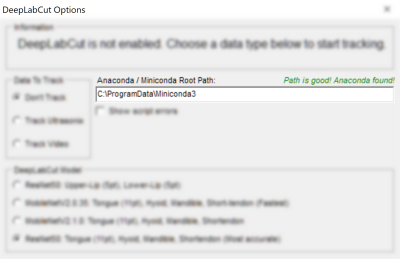

> ## Contents
> 2. [Introduction](#what-is-deepLabCut)
> 3. [Glossary of terms](#glossary)
> 4. [First-time Setup](#using-deeplabcut-for-the-first-time)
> 5. [Installing DeepLabCut Models](#installing-deeplabcut-models)
> 6. [Analysing data and live-tracking](#using-deeplabcut-in-aaa)
> 7. [Troubleshooting Problems](#troubleshooting)

-------------------
System Requirements
-------------------
The files in this repository are designed for use with [_Articulate Assistant Advanced_](http://www.articulateinstruments.com/downloads/),  software for speech articulatory analysis and recording by Articulate Instruments.

You will also need:
 - Windows 10 or later (Windows 7 or 8 might work but are not officially supported; use at your own risk).
 - At least 3.6 GB free space on your hard drive to install downloaded software to.
 - Analysing recorded data should work on any computer, but if you want real-time tracking as well then you will need a [CUDA compatible GPU](https://en.wikipedia.org/wiki/CUDA) in your computer, and having one will also massively speed up data analysis. CUDA is only compatible with Windows 10 and later.

**NB**: You do _not_ need to manually download or install DeepLabCut. Continue reading this page for installation instructions.

-------------------
What is DeepLabCut?
-------------------
DeepLabCut is open-source software with which you can train machine-learning models to automatically determine the coordinates of real-world objects from images and video. _Articulate Assistant Advanced_ interfaces with it directly so you can automatically annotate ultrasound data and video-camera data with splines just by using the normal _AAA_ menus.

DeepLabCut can run on any computer running Windows 10 and later (and might also work on Windows 7 and 8, but doing so is untested and not officially supported). If your computer also contains a CUDA GPU then DeepLabCut can use this to process data a lot faster.

In _AAA_ you can either use DeepLabCut to spline existing recordings or use it to track anatomy live in real-time. However, for live tracking only a computer with a CUDA GPU (as of the year 2022) can process data fast enough to support real-time tracking.

DeepLabCut was created by [Mathis, A.](https://scholar.google.co.uk/citations?user=Y1xCzE0AAAAJ), [Mamidanna, P.](https://scholar.google.co.uk/citations?user=5x1hXY8AAAAJ), [Cury, K.M.](https://scholar.google.co.uk/citations?user=KpSNbF4AAAAJ) et al. (2018) ([10.1038/s41593-018-0209-y](https://www.nature.com/articles/s41593-018-0209-y)) with additional software by [Nath, T.](https://scholar.google.co.uk/citations?user=KXmpTjwAAAAJ), [Mathis, A.](https://scholar.google.co.uk/citations?user=Y1xCzE0AAAAJ) et al. (2019) ([10.1038/s41596-019-0176-0](https://www.nature.com/articles/s41596-019-0176-0)) and [Mathis, A.](https://scholar.google.co.uk/citations?user=Y1xCzE0AAAAJ), [Biasi T.](https://www.researchgate.net/profile/Thomas-Biasi) et al. (2021)

--------
Glossary
--------
Some shorthand terms will be used throughout this tutorial:
 - "**Model**" = A neural net's trained memory for a specific task, ie. a standalone bundle of files and folders representing training, which can then be used to automatically plot points on new data.
 - "**DLC**" = DeepLabCut, the software tool for training and using models.
 - "**AAA**" = Articulate Assistant Advanced.

-----------------------------------
Using DeepLabCut for the first time
-----------------------------------
DeepLabCut is a powerful but often complicated software tool. Many people struggle a lot with their first time using it. To make life easier, _AAA_ handles most of the complicated stuff automatically so you can work with a much simpler interface.

If this is your first time using DeepLabCut, you will first need to manually install a free open-source software tool called [Anaconda](https://docs.conda.io/en/latest/miniconda.html). It is a popular data science tool which _AAA_ will automatically communicate with to install, update and run DeepLabCut. If you already have a full version of Anaconda installed you can use that instead.

In _AAA_, you can open the DeepLabCut settings menu either from the `Edit Splines` dialog or from the `Live Tracker` tabs of `Ultrasonic Setup` or `Video Setup`. (These can be accessed by right-clicking on an ultrasound or video display). You will be presented with a few options: one of them will be a place where you should type in the full path to your Anaconda directory (with no trailing backslash):

If you have a [CUDA compatible GPU](https://en.wikipedia.org/wiki/CUDA) then you need to install the [CUDA drivers](https://developer.nvidia.com/cuda-downloads) to benefit from it. Without the correct CUDA drivers, DeepLabCut will still successfully analyse data but will do so by falling-back to using your CPU instead, which will likely be many times slower.

----------------------------
Installing DeepLabCut models
----------------------------
You must make at least one Model available to _AAA_ or else it cannot use DeepLabCut to analyse data. Each Model is trained to perform a specific task, for example annotating tongue and mouth anatomy from mid-sagittal ultrasound images, or annotating lips from camera images captured facing the front of the mouth.

Models trained by Articulate Instruments for use in speech production analysis and visual feedback are available for <a href="#top">free download here</a> in this repository. Over time the models available here may be updated to improve accuracy or performance, or new models might be added to perform different analyses.

Each model should be a folder containing:
 - `Snapshot` files
 - A `pose_cfg.yaml` file
 - A `AAAmodel` file

Please put each such folder inside the `\DLCModels` folder in your _AAA_ directory. An example of correct folder structure is below.

If no `\DLCModels` folder exists you may not be running a recent enough version of _AAA_ to support integrated DeepLabCut. Consider [updating your _AAA_ version](http://www.articulateinstruments.com/downloads/). If you have a sufficiently recent version of _AAA_ and the folder is still missing, you can safely create it yourself and put the model folders in it, as above.

If you have used DeepLabCut before, you can also use models which you have trained or used previously with _AAA_, but to use them you must first convert them to DeepLabCut-Live format. [Official documentation on this can be found here.](https://deeplabcut.github.io/DeepLabCut/docs/HelperFunctions.html#new-model-export-function) For example: if your DLC model was in `C:\MyModel` then inside your appropriate DeepLabCut conda environment and within iPython and after importing DeepLabCut, you could use the command `deeplabcut.export_model("C:\MyModel\config.yaml", iteration=None, shuffle=1, trainingsetindex=0, snapshotindex=None, TFGPUinference=True, overwrite=False, make_tar=True)` substituting the other arguments with your own settings. It would then export the model to the folder `C:\MyModel\exported-models`. It may require the folder `\exported-models` to **NOT** exist or the process might fail.

-----------------------
Using DeepLabCut in _AAA_
-----------------------
Once you have successfully installed all requirements using the instructions above, you are ready to use DeepLabCut!

In _AAA_ you can **only** fit 2D splines using DeepLabCut due to fan splines being unsuitable for tracking lateral movement of objects. If you really want to use Fan Splines then you can easily convert 2D splines to Fan Splines (or vice versa) by opening the `Edit Splines` dialog and selecting the `Splines` tab, then selecting the spline you wish to convert and clicking the `Convert` button. However, **doing this will destroy information**. 2D splines can double-back on themselves but Fan splines cannot: converting 2D to Fan will preserve only the closest spline surface to the probe origin. Furthermore, there cannot be more or less knots than fan lines, so additional knots may need to be created at arbitrary radii, and knots beyond the range of the fan will be removed.

**In _AAA_, there are two ways to use DeepLabCut**:

### 1. Analysing existing data
- Open the `Edit Splines` dialog by right-clicking an ultrasound or video display.
- Click on the `Fit Spline` tab and select the `DeepLabCut` option.
- Click the `DeepLabCut Settings` button above and choose a Model from the list at the bottom. If no Models are available it may be because of an unsuccessful [installation of Models](#installing-deeplabcut-models).
- Select the `Batch` tab and `Choose Recordings`.
- Select the `Process Batch` tab and tick the checkboxes for the splines you wish for the Model to add to your recording. They will be created as splines with the same names as shown in that list.
- Batch splining many recordings could take a long time if you **don't** have a CUDA GPU: up to twenty times longer than the duration of the recorded data being splined. When you are ready to spline your selected data, click `Process`.

### 2. Tracking live ultrasound or video feeds
- Open the `Ultrasonic Setup` -> `Display Options` or `Video Setup...` by right-clicking on a live ultrasound or video display.
- Click on the appropriate `Live Tracker` tab and open the `DeepLabCut-Live` settings.
- Choose a Model from the list at the bottom. If no Models are available it may be because of an unsuccessful [installation of Models](#installing-deeplabcut-models).
- When you are ready to start live-tracking, select `Live Ultrasonix` or `Live Video` on the left. _AAA_ may pause for up to a minute while it loads a Model. You can change the Model at any time while live-tracking, and doing so will pause tracking while it changes Model.
- _AAA_ does not currently support recording data while simultaneously live-tracking, so live-tracking will be automatically disabled if you start recording.

---------------
Troubleshooting
---------------
### When I run _AAA_, it says it's unable to load any models; what do I do?
Please ensure you have downloaded the models from this repository and installed them into the same installation folder of _AAA_ as you wish to use, by carefully following the [instructions here](#installing-deeplabcut-models).

### AAA freezes when I try and batch-spline or use live-tracking!
The first time you tell _AAA_ to use a DLC model it needs to load the model and initialise DeepLabCut, and this can take a long time, but should not take longer than a minute even on an old computer.

If you think something is wrong and AAA is really frozen, please check your Windows Taskbar where you might see a Windows Command Prompt running.
- If there _is_ a Command Prompt visible: It should be displaying the output of DeepLabCut. Any messages in it are created by DeepLabCut and not by _AAA_. There may be important information in there which explains why it appears to not be proceeding.
- If there's _not_ any Command Prompt visible: This is likely a symptom of DeepLabCut crashing while trying to start up or process data. Normally when DeepLabCut closes due to finishing successfully, the Command Prompt will automatically close, but can also close prematurely if it crashes. Please restart _AAA_ and return to the DeepLabCut options dialog in _AAA_. This time, check the box labelled `Show script errors` and try to repeat what you did that led to the freeze. This time the DeepLabCut Command Prompt window will remain open after DeepLabCut exits and you can read any error messages it produces.

### How do I change how AAA creates splines from the data?
Each model folder contains a file called `AAAmodel` which can be edited using any text editor. It contains comments explaining the exposed properties of the model.

You can safely change the following properties of a model:
 - Display name
 - How the tracked points get interpreted into AAA splines

You can also change the following properties, but it is strongly advised that you do **not** modify them as their values are chosen to produce the most accurate tracking:
 - What pixel resolution images should be resized to before being passed to DLC
 - How changes of aspect ratio should be handled in the resizing operation

This is because DLC models' training is specific to an image resolution and tracking accuracy deteriorates the more you diverge from the image resolution and aspect ratio used in training.

### How do I know which DLC model to use?
This repository provides multiple models for different purposes. Inside each model's folder is a separate README file which explains the model's purpose and behaviour. There are also multiple models for each purpose, such as multiple models for human oral mid-sagittal ultrasound: these differ in a tradeoff of accuracy and speed. As a general rule, `ResNet50` models provide the best accuracy but at a cost of significantly slower speed analysing data. Conversely, `MobileNetv2 0.35` models can analyse data at the fastest speeds but are the least accurate. `MobileNetv2 1.00` is a midpoint between the other two in both measures. You can read the [official DeepLabCut documentation on the different neural networks here](https://deeplabcut.github.io/DeepLabCut/docs/recipes/nn.html#what-neural-network-should-i-use-trade-offs-speed-performance-and-considerations). Exact accuracy and speed measures can be read from inside the `AAAmodel` file in each model's folder, by opening it with any text editor.
