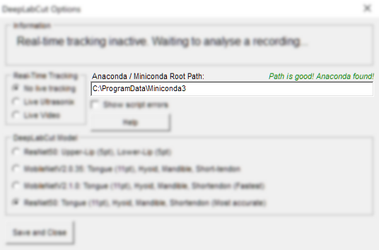

> ## Contents
> 1. [Prerequisites](#system-requirements)
> 1. [Introduction](#what-is-deeplabcut)
> 2. [First-time Setup](#using-deeplabcut-for-the-first-time)
> 3. [Installing DeepLabCut Models](#installing-deeplabcut-models)
> 4. [Analysing data and live-tracking](#using-deeplabcut-in-aaa)
> 5. [Troubleshooting Problems](#troubleshooting)

----------------------------------------------
# &rarr; [Download tongue and lip models here](https://github.com/articulateinstruments/AAA-DeepLabCut-Resources/releases) &larr;

System Requirements
-------------------
The files in this repository are designed for use with [_Articulate Assistant Advanced_](http://www.articulateinstruments.com/downloads/),  software for speech articulatory analysis and recording by Articulate Instruments.

You will also need:
 - Windows 10 or later (Windows 7 or 8 work but see troubleshooting; use at your own risk).
 - At least 3.6 GB free space on your hard drive to install downloaded software to.
 - Analysing recorded data and real-time tracking should work on any computer, but if you want live-tracking at a high framerate and much faster data analysis then you will need a [CUDA compatible GPU](https://en.wikipedia.org/wiki/CUDA) in your computer. CUDA is only compatible with Windows 10 and later.

**NB**: You do _NOT_ need to manually download or install DeepLabCut. Continue reading this page for installation instructions.

--------
Glossary
--------
Some shorthand terms will be used throughout this tutorial:
 - "**Model**" = A neural net's trained memory for a specific task, ie. a standalone bundle of files and folders representing training, which can then be used to automatically plot points on new data.
 - "**AAA**" = Articulate Assistant Advanced.
 - "**DLC**" = DeepLabCut, the software tool for training and using models.

-------------------
What is DeepLabCut?
-------------------
[DeepLabCut](http://www.mackenziemathislab.org/deeplabcut) is popular free open-source software which you can use to train machine-learning models that automatically determine the coordinates of real-world objects from images and video. _Articulate Assistant Advanced_ interfaces with it directly so you can automatically annotate ultrasound data and video-camera data with splines just by using the normal _AAA_ menus.

DeepLabCut can run on any computer running Windows 10 and later (see troubleshooting for running on Windows 7 and 8). If your computer also contains a [CUDA GPU](https://developer.nvidia.com/cuda-gpus) then DeepLabCut can use this to process data a lot faster.

In _AAA_ you can either use DeepLabCut to spline existing recordings or use it to track anatomy live in real-time. For live tracking, a computer with an NVIDIA GPU supporting CUDA can process data fast enough to do real-time tracking at 50-60 Hz (which is the fastest that most computer monitors can display), and if you don't have a CUDA GPU then a common office PC in 2022 can do 15-25 Hz.
> _The lower framerate on a common office PC is fast enough to be adequate for live-tracking most tongue movements, but some particularly fast tongue movements such as trills may be too fast to live-track without a higher-end PC and/or a CUDA GPU. However, even on a budget PC recording data for later analysis will always be done at the maximum framerate of the ultrasound hardware, which depending on the system will likely be between 80 - 120 Hz._

DeepLabCut was created by [Mathis, A.](https://scholar.google.co.uk/citations?user=Y1xCzE0AAAAJ), [Mamidanna, P.](https://scholar.google.co.uk/citations?user=5x1hXY8AAAAJ), [Cury, K.M.](https://scholar.google.co.uk/citations?user=KpSNbF4AAAAJ) et al. (2018) ([10.1038/s41593-018-0209-y](https://www.nature.com/articles/s41593-018-0209-y)) with additional software by [Nath, T.](https://scholar.google.co.uk/citations?user=KXmpTjwAAAAJ), [Mathis, A.](https://scholar.google.co.uk/citations?user=Y1xCzE0AAAAJ) et al. (2019) ([10.1038/s41596-019-0176-0](https://www.nature.com/articles/s41596-019-0176-0)) and [Mathis, A.](https://scholar.google.co.uk/citations?user=Y1xCzE0AAAAJ), [Biasi T.](https://www.researchgate.net/profile/Thomas-Biasi) et al. (2021)

----------------------------------------
How to use DeepLabCut for the first time
----------------------------------------
DeepLabCut is a powerful but often complicated software tool. Many people struggle a lot with their first time using it. To make life easier, _AAA_ handles most of the complicated stuff automatically so you don't have to. If you only want to fit splines to your data (either individually or as a batch process) and/or use live-tracking for oral anatomy then just follow the rest of the instructions in this document. If you want to use DeepLabCut in a more complicated way not covered by AAA's simplified interface, [you can read a tutorial on using DeepLabCut's more advanced features with AAA here](https://github.com/articulateinstruments/DeepLabCut-for-Speech-Production#readme). 

If this is your first time using DeepLabCut, you will first need to manually install a free open-source software tool called [Anaconda](https://docs.conda.io/en/latest/miniconda.html). It is a popular data science tool which _AAA_ will automatically communicate with to install, update and run DeepLabCut. If you already have a full version of Anaconda installed you can use that instead.
> There are two versions of the Anaconda software to choose between. [Miniconda](https://docs.conda.io/en/latest/miniconda.html) is a compact, simplified version of Anaconda that takes less file space on your computer and has everything needed to run DeepLabCut in AAA. However, it lacks the broad range of data science tools and pre-installed packages that are included in the [full version of Anaconda](https://www.anaconda.com/products/distribution#Downloads), which require a larger download and more hard-drive space. If you don't plan to use Anaconda for any other purpose than DeepLabCut in AAA then Miniconda is sufficient.

In _AAA_, you can open the DeepLabCut settings menu either from the `Edit Splines` dialog or from the `Live Tracker` tabs of `Ultrasonic Setup` or `Video Setup`. (These can be accessed by right-clicking on an ultrasound or video display). You will be presented with a few options: one of them will be a place where you should type in the full path to your Anaconda directory (with no trailing backslash):

If your computer contains an [NVIDIA CUDA compatible GPU](https://en.wikipedia.org/wiki/CUDA) then your computer can run DeepLabCut up-to 4 times faster. However, to benefit from this additional performance you must complete all of the following _additional_ installation steps:
1. **Install [Visual Studio 2019](https://my.visualstudio.com/Downloads?q=visual%20studio%20community%202019) _(it must be the 2019 version; more recent versions of Visual Studio won't help)_. Ensure that Visual Studio 2019 has the `Desktop development with C++` _Workload_ enabled with the `MSVC v142 ...` and `C++ CMake Tools for Windows` components.** If you already have a version of Visual Studio 2019 installed, you can modify it to include the _Workload_ by opening your Windows Start menu and searching for `Visual Studio Installer` and running it, then _modifying_ your existing Visual Studio 2019. 
> You can reduce the hard-drive space that Visual Studio 2019 takes up by deselecting certain _Individual Components_ of the `Desktop development with C++` _Workload_ that are not required: you **must** keep `MSVC v142 ...` and `C++ CMake Tools for Windows` enabled, but you can safely de-select the other components.

2. **Install the [CUDA 11.2 drivers](https://developer.nvidia.com/cuda-11.2.0-download-archive) _(it must be this version; more recent versions of CUDA won't work)_.** 
3. **_After_ successfully installing CUDA 11.2, copy [these dll files](https://www.dropbox.com/scl/fo/6spbo6s3j3orsd61ienon/h?rlkey=wnw92inyyl5o5sqil245ylh2z&dl=0) into the `C:\Program Files\NVIDIA GPU Computing Toolkit\CUDA\v11.2\bin` folder.**
> **If you get an error**: If your computer already has up-to-date Nvidia drivers installed then when you attempt to install the CUDA 11.2 drivers it may give an error saying that it refuses to install version 11.2 when there is more recent Nvidia software already on the computer; to resolve this you should **uninstall** the `Nvidia Frameview SDK`, which you can do by opening your Windows Start menu and opening `Add or remove programs`, then using the search box to search for `Frameview`, clicking on it when it appears, and uninstalling it. After doing this, restart your computer and then try installing CUDA 11.2 again. If this does not work, you may need to also remove any other versions of CUDA on your computer using a similar method.

If you failed to complete all the above steps correctly then DeepLabCut will _still successfully analyse data_ but will do so by falling-back to using your CPU instead, which will likely be many times slower. You can verify if CUDA is working successfully to speed up your data processing: to do this, attempt to use DeepLabCut in AAA _(for instructions on how to do so, please continue reading this document)_. When you begin using DeepLabCut to apply a spline or do live-tracking, a Windows Command Prompt window will appear in your taskbar at the bottom of your screen. Please click on it to view it and then read the text within it. If you installed CUDA correctly as above, then you should see a line appear part-way through the text which says:

**`Created device with ... memory  --> device: 0, name: [Your GPU's name]`**

You can find the name of your GPU by opening your Windows Start menu and opening `Device Manager`, then within that open the subheading `Display Adapters`, which will list all the GPUs in your computer. If you have at least one NVIDIA device listed there then DeepLabCut will be able to use it if you performed the above steps correctly.

------------------------
Adding DeepLabCut models
------------------------
You must make at least one Model available to _AAA_ or else it cannot use DeepLabCut to analyse data. Each Model is trained to perform a specific task, for example annotating tongue and mouth anatomy from mid-sagittal ultrasound images, or annotating lips from camera images captured facing the front of the mouth.

Models trained by Articulate Instruments for use in speech production analysis and visual feedback are available for free download in this repository at the <a href="#top">top of this page</a>. You can download individual models from [Releases](https://github.com/articulateinstruments/AAA-DeepLabCut-Resources/releases) or [clone this repository](#how-should-I-clone-this-repository) to your `AAA\DLCModels` folder. Over time the models available here may be updated to improve accuracy and/or performance, and new models might be added to perform different analyses.

Each model should be a folder containing:
 - `Snapshot` files
 - A `pose_cfg.yaml` file
 - A `AAAmodel` file

Please put each such folder inside the `\DLCModels` folder in your _AAA_ directory. An example of correct folder structure is below.

If no `\DLCModels` folder exists you may not be running a recent enough version of _AAA_ to support integrated DeepLabCut. Consider [updating your _AAA_ version](http://www.articulateinstruments.com/downloads/). If you have a sufficiently recent version of _AAA_ and the folder is still missing, you can safely create it yourself and put the model folders in it, as above.

If you have used DeepLabCut before, you can also use models which you have trained or used previously with _AAA_, but to use them you must first convert them to DeepLabCut-Live format. [Official documentation on this can be found here.](https://deeplabcut.github.io/DeepLabCut/docs/HelperFunctions.html#new-model-export-function) For example: if your DeepLabCut model was in `C:\MyModel` then inside your appropriate DeepLabCut conda environment and within iPython and after importing DeepLabCut, you could use the command `deeplabcut.export_model("C:\MyModel\config.yaml", iteration=None, shuffle=1, trainingsetindex=0, snapshotindex=None, TFGPUinference=True, overwrite=False, make_tar=True)` substituting the other arguments with your own settings. It would then export the model to the folder `C:\MyModel\exported-models`. It may require the folder `\exported-models` to **NOT** exist or the process might fail.

At this point, you should have now installed your preferred version of [Anaconda](#using-deeplabcut-for-the-first-time), typed its path into AAA, and [installed at least one model](#installing-deeplabcut-models). The final step is to tell AAA to automatically install the DeepLabCut software, and this can be done in either of two ways:
 - Restart AAA and follow the instructions to install DeepLabCut that should appear at startup.
 - Attempt to use DeepLabCut in AAA, either by enabling real-time live DLC tracking or by attempting to batch fit splines to an ultrasound or video recording using DLC: AAA will automatically install DLC the first time you do this if it isn't installed yet. Instructions on how to use DLC in AAA can be found below.

-----------------------
Using DeepLabCut in _AAA_
-----------------------
Once you have successfully installed all requirements using the instructions above, you are ready to use DeepLabCut!

In _AAA_ you can **only** fit 2D splines using DeepLabCut due to fan splines being unsuitable for tracking lateral movement of objects. If you really want to use Fan Splines then you can easily convert 2D splines to Fan Splines (or vice versa) by opening the `Edit Splines` dialog and selecting the `Splines` tab, then selecting the spline you wish to convert and clicking the `Convert` button. However, **doing this will destroy information**. 2D splines can double-back on themselves but Fan splines cannot: converting 2D to Fan will preserve only the closest spline surface to the probe origin. Furthermore, there cannot be more or less knots than fan lines, so additional knots may need to be created at arbitrary radii, and knots beyond the range of the fan will be removed.

**In _AAA_, there are two ways to use DeepLabCut**:

### 1. Analysing existing data
- Open the `Edit Splines` dialog by right-clicking an ultrasound or video display.
- Click on the `Fit Spline` tab and select the `DeepLabCut` option.
- Click the `DeepLabCut Settings` button above and choose a Model from the list at the bottom. If no Models are available it may be because of an unsuccessful [installation of Models](#installing-deeplabcut-models).
- Select the `Batch` tab and `Choose Recordings`.
- Select the `Process Batch` tab and tick the checkboxes for the splines you wish for the Model to add to your recording. They will be created as splines with the same names as shown in that list.
- Batch splining many recordings could take a long time if you **don't** have a CUDA GPU: up to twenty times longer than the duration of the recorded data being splined. When you are ready to spline your selected data, click `Process`.

### 2. Tracking live ultrasound or video feeds
- Open the `Ultrasonic Setup` -> `Display Options` or `Video Setup...` by right-clicking on a live ultrasound or video display.
- Click on the appropriate `Live Tracker` tab and open the `DeepLabCut-Live` settings.
- Choose a Model from the list at the bottom. If no Models are available it may be because of an unsuccessful [installation of Models](#installing-deeplabcut-models).
- When you are ready to start live-tracking, select `Live Ultrasonix` or `Live Video` on the left. _AAA_ may pause for up to a minute while it loads a Model. You can change the Model at any time while live-tracking, and doing so will pause tracking while it changes Model.
- _AAA_ does not currently support recording data while simultaneously live-tracking, so live-tracking will be automatically disabled if you start recording.

---------------
Troubleshooting
---------------
### I tried to install Anaconda3/Miniconda3 in Windows 7 and get "Error installing: Failed to create menus"
Newer versions of Anaconda3/Miniconda3 do not install on Windows 7.  Go to the archive page (https://repo.anaconda.com/miniconda/) and install 'Miniconda3-4.7.12.1-Windows-x86_64.exe' instead of the latest version.
### How do I know which DeepLabCut model to use?
This repository provides multiple models for different purposes. Inside each model's folder is a separate README file which explains the model's purpose and behaviour. There are also multiple models for each purpose, such as multiple models for human oral mid-sagittal ultrasound: these differ in a tradeoff of accuracy and speed.

Unidirectional models are better at estimating the positions of anatomy when the image is poor, but they require you to tell AAA which direction the tongue tip is facing in the image when you use the model. Bidirectional models don't need to be told what direction the tongue tip is facing, which can help when batch processing many recordings containing a mixture of tongue-tip directions, but they sometimes produce unexpected behaviours when the image is poor.

As a general rule, `ResNet50` models provide the best accuracy but at a cost of significantly slower speed analysing data. Conversely, `MobileNetv2 0.35` models can analyse data at the fastest speeds but are the least accurate. `MobileNetv2 1.00` is a midpoint between the other two in both measures. You can read the [official DeepLabCut documentation on the different neural networks here](https://deeplabcut.github.io/DeepLabCut/docs/recipes/nn.html#what-neural-network-should-i-use-trade-offs-speed-performance-and-considerations). Exact accuracy and speed measures can be read from inside the `AAAmodel` file in each model's folder, by opening it with any text editor. Whenever you analyse data inside AAA using DeepLabCut, either splining or live-tracking, it will automatically update the `AAAmodel` file with the average analysis speed of the model(s) you experienced on your computer.

### When I run _AAA_, it says it's unable to load any models; what do I do?
Please ensure you have downloaded the models from this repository and installed them into the same installation folder of _AAA_ as you wish to use, by carefully following the [instructions here](#installing-deeplabcut-models).

### AAA freezes when I try and batch-spline or use live-tracking!
The first time you tell _AAA_ to use a DeepLabCut model it needs to load the model and initialise DeepLabCut, and this can take a long time, but should not take longer than a minute even on an old computer.

If you think something is wrong and AAA is really frozen, please check your Windows Taskbar where you might see a Windows Command Prompt running.
- If there _is_ a Command Prompt visible: It should be displaying the output of DeepLabCut. Any messages in it are created by DeepLabCut and not by _AAA_. There may be important information in there which explains why it appears to not be proceeding.
- If there's _not_ any Command Prompt visible then it might have gone really wrong: This may be a _AAA_ bug rather than a DeepLabCut crash. Normally when DeepLabCut closes due to finishing successfully the Command Prompt will automatically close, and if there's a problem with DeepLabCut it should remain open so you can see what went wrong. If it's not visible it might be a symptom of _AAA_ failing to start it at all. Please restart _AAA_ and return to the DeepLabCut options dialog. This time, please check the box labelled `Show script errors` and try to repeat what you did that led to the freeze. This will force the DeepLabCut Command Prompt window to be visible and remain open no matter what happens, and it might contain helpful information. If you can't resolve the problem easily, please contact us and we can help!

### Live-tracking starts to slow down a lot after a few minutes. Why?
This is likely because your computer is throttling your computer's processor to prevent it overheating or drawing too much power. This is something laptops often do a lot, but it's unlikely to affect desktop PCs. If you're using a Nvidia GPU there are some settings you can change in your Nvidia Control Panel or GeForce Experience (which can be found in your Windows Start menu) to prevent your computer from deliberately slowing your GPU down when it works too hard: these settings are often found under categories or headings relating to battery usage / power management. Be careful, however, because manufacturers put these settings in for good reason: you can drain a laptop's battery really fast by running its GPU at maximum power all the time.

### How do I change how AAA creates splines from the data?
Each model folder contains a file called `AAAmodel` which can be edited using any text editor. It contains comments explaining the exposed properties of the model.

You can safely change the following properties of a model:
 - _Display name_
 - _How the tracked points get interpreted into AAA splines_
 - _The colors used to distinguish each point during live-tracking_

You can also change the following properties, but it is strongly advised that you do **not** modify them as their values are chosen to produce the most accurate tracking:
 - _What pixel resolution images should be resized to before being passed to DeepLabCut_
 - _How changes of aspect ratio should be handled in the resizing operation_

This is because DeepLabCut models' training is specific to an image resolution and tracking accuracy deteriorates the more you diverge from the image resolution and aspect ratio used in training.

### How should I clone this repository?
The advantage of cloning this repo to your `AAA\DLCModels` folder is you can simply pull changes whenever we update the models or add new ones and they will be immediately available within AAA.

Please ensure that you clone this repository to within `AAA\DLCModels` and **not** a folder within it. For example, it should be cloned such that a model called `ResNet50` would be at the path:
- `AAA\DLCModels\ResNet50\` = **GOOD**
- `AAA\DLCModels\AAA-DeepLabCut-Resources\ResNet50` = **BAD**

Links to clone are available at the <a href="#top">top of this page</a>.

If you are unfamiliar with using _Git_, you can quickly clone this repository in this way by opening a _Windows Command Prompt_ or _Powershell_ window and navigating it to the `AAA\DLCModels` folder, then typing:
`git clone articulateinstruments/AAA-DeepLabCut-Resources`

Once you clone it in this way, you can open this new local repo you have created in any Git software of your choice, such as _GitHub Desktop, GitKraken, TortoiseGit, VSCode_, etc. From there, you can easily download updates and get new models by fetching and pulling. If you only want to work from the command-line, you can open a _Windows Command Prompt_ or _Powershell_ window and navigate it to the `AAA\DLCModels` folder, then type: `git pull`
